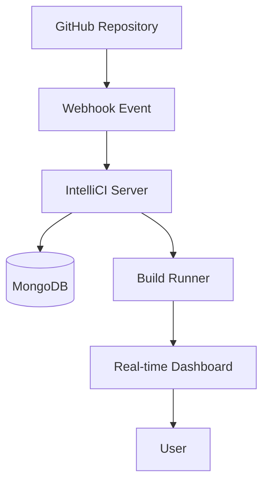

A lightweight, self-hosted Continuous Integration server that automatically builds and tests your code on every push. Get GitHub Actions-like functionality on your own infrastructure.

## Features

- **GitHub Webhook Integration** - Automatically trigger builds on push events
- **Real-time Dashboard** - Live build logs and progress updates
- **Secure** - GitHub webhook signature verification
- **Build History** - Track success rates and performance metrics
- **Fast** - Parallel build processing with intelligent caching

## 🏗️ Architecture


## Getting Started Follow these steps to set up IntelliCI locally:
Follow these steps to set up IntelliCI locally:
```bash
# Clone the repository
git clone https://github.com/Darshwan/IntelliCI-Server.git
cd intellici

# Install dependencies
npm install

# Edit .env with your configuration

# Start the server
npm run dev
```
### How It Works

1. Push code to GitHub → triggers a webhook to IntelliCI

2. Webhook handler validates

3.	Build Runner executes your pipeline (npm install && npm test)

4.	Logs stream to dashboard in real-time

5.	Results saved in MongoDB for build history

## License
MIT License

## Documentation

*   [API Reference](https://github.com/Darshwan/IntelliCI-Server/blob/master/docs/API_REFERENCE.md)
*   [GitHub Webhook Setup Guide](https://github.com/Darshwan/IntelliCI-Server/blob/master/docs/WEBHOOK_SETUP.md)

 # Usage
- Set up GitHub Webhook in your repository settings
- Push code to trigger automated builds
- Monitor builds in the real-time dashboard
- View build history and metrics

🤝 Contributing
We welcome contributions! .

📝 License
This project is licensed under the MIT License - see the 
[LICENSE file](https://github.com/Darshwan/IntelliCI-Server/blob/master/LICENSE) for details.

# Don't Forget to Star this repo !!!